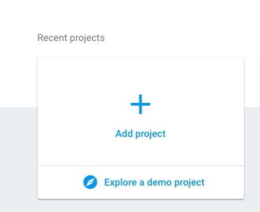
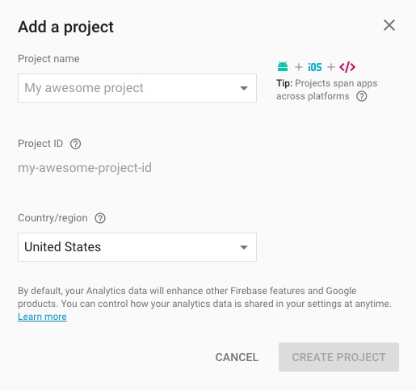
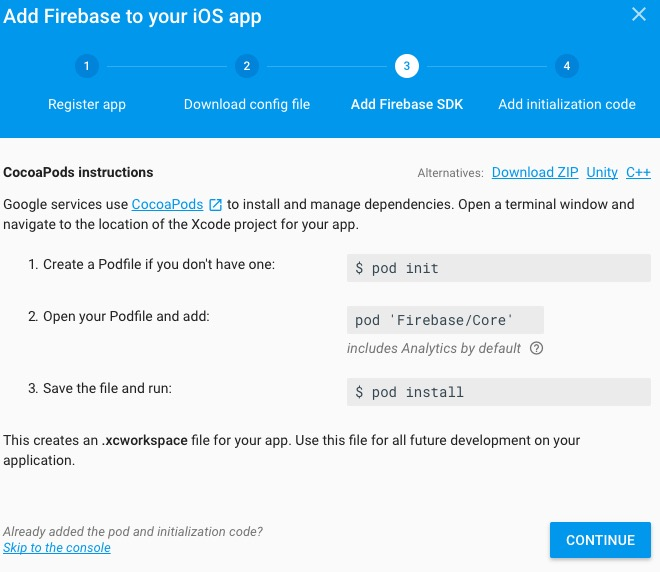
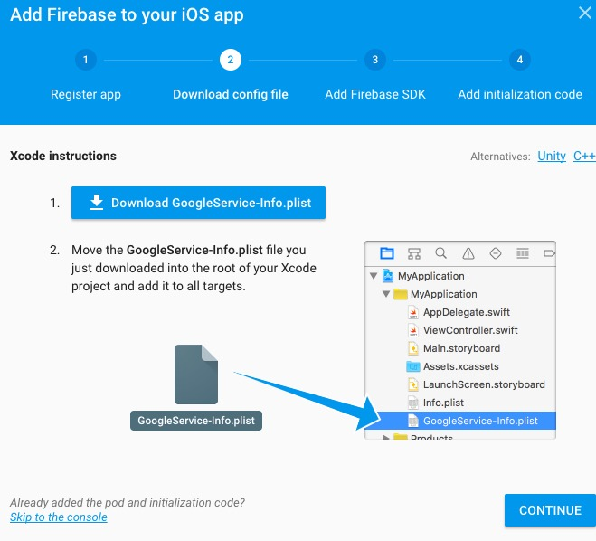
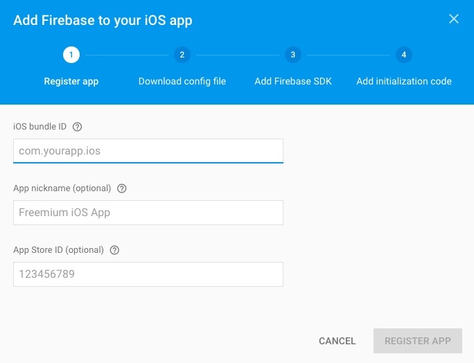
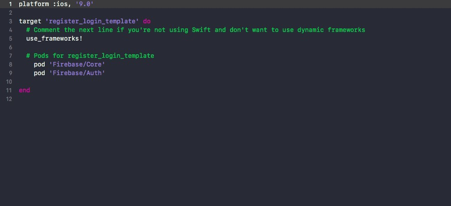
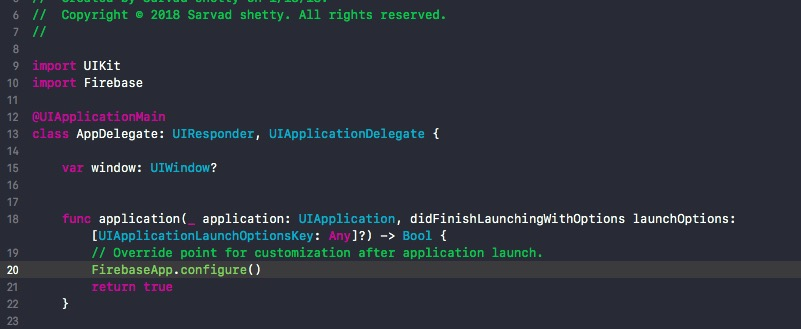
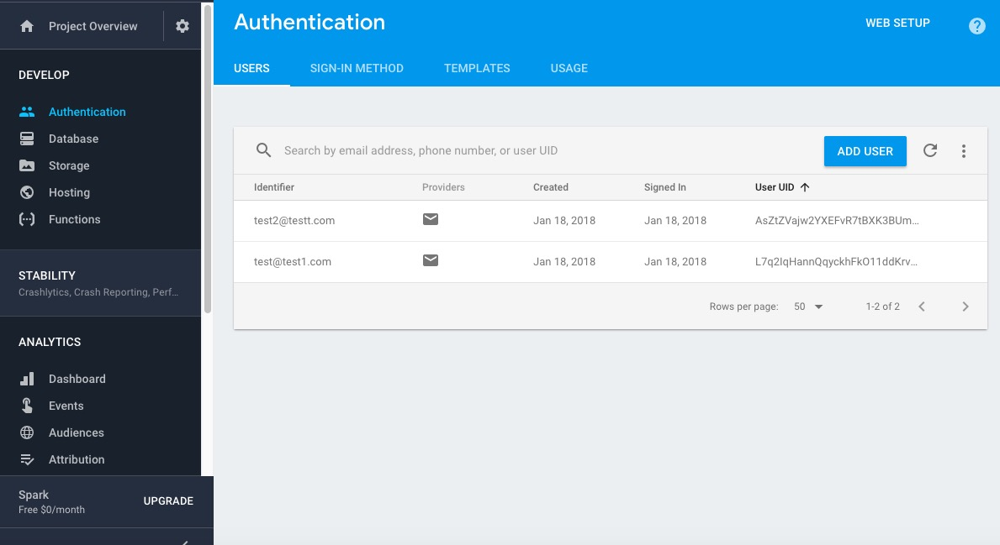
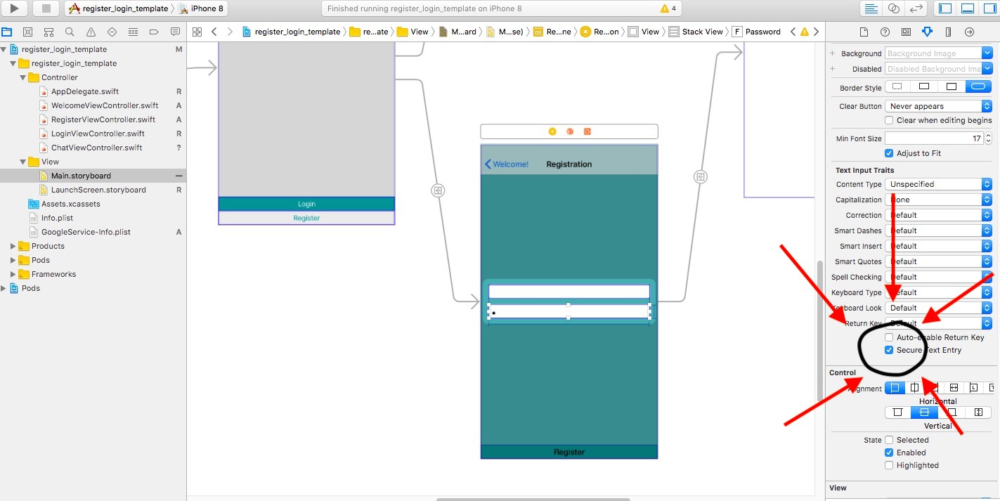
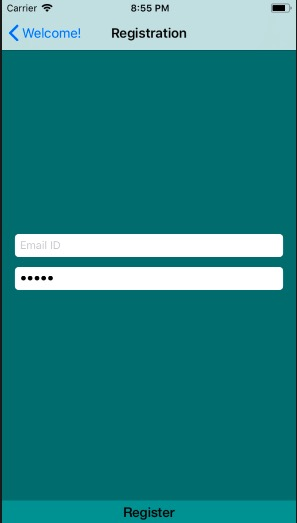

# register_login_template
To get started go to this url:
https://console.firebase.google.com 
 
Then click on add project 
 
 
Then enter the details like name of your project and choose country region 
 
 
After that go through the instructions for installing pods 
 
 
Download the google-info.plist and add it to your xcode project 
 
 
Next add your bundle id which is located in your xcode project remaining two fields are optional 
 
 
Your Podfile should look like this : 
 
 
After installing the pods open the "your_project_name.xcworkspace" file,this is what you're going to be working on 
 
Go to the AppDelegate file and add the following code 
 
 
After creating the app and registering few users, the authentication page in your console will look like this 
 
 
While typing the password in the textfield,to hide it do this: 
 
 
Your password textfield will look like this 
 
 
Do it for both the registration view controller and the login view controller  
